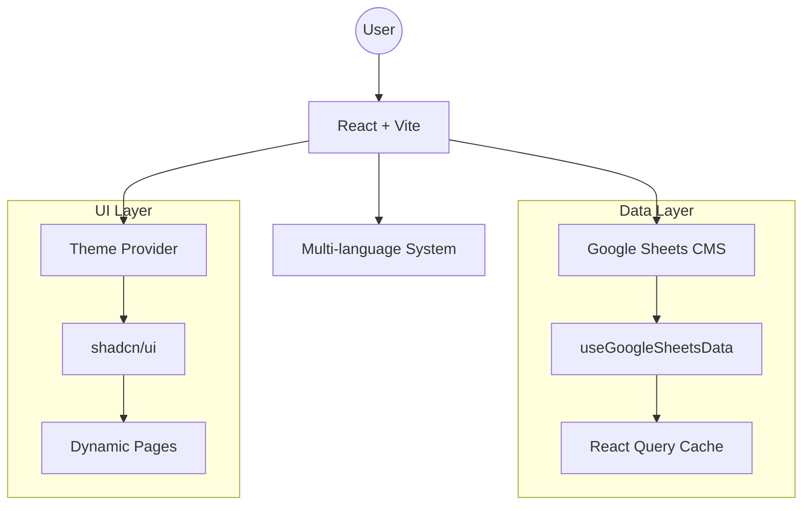

# 🏥💳 Auxility Marketing Hub

> Enterprise-grade marketing website for FinTech & Healthcare software development company.


## ✨ Key Features

| Feature | Description |
|---------|-------------|
| 🌐 **Multi-language (i18n)** | Full support for English, Russian, and Kazakh |
| 📊 **Google Sheets CMS** | Real-time content management without code changes |
| 🎨 **Dark/Light Mode** | Animated theme switching with system preference detection |
| 📱 **PWA Ready** | Installable on mobile devices with offline capability |
| 🔍 **SEO Optimized** | Meta tags, Open Graph, JSON-LD structured data |
| ⚡ **Performance** | React Query caching, Vite tree-shaking, lazy loading |
| 🎭 **Animations** | Framer Motion transitions, scroll-triggered reveals |
| 🧊 **3D Elements** | Three.js floating shapes for premium visual depth |

## 🏗️ Architecture



## 🚀 Quick Start

```bash
# Install dependencies
npm install

# Start development server
npm run dev

# Run tests
npm run test

# Build for production
npm run build
```

## 📁 Project Structure

```
src/
├── components/
│   ├── 3d/              # Three.js components
│   ├── layout/          # Navbar, Footer
│   ├── sections/        # Page sections
│   ├── seo/             # SEO components
│   └── ui/              # shadcn/ui components
├── hooks/
│   ├── useCopy.ts       # i18n text retrieval
│   ├── useLanguage.tsx  # Language state
│   └── useGoogleSheetsData.ts
├── data/
│   └── defaultCopy.ts   # Default translations
├── lib/
│   ├── i18n.ts          # Language utilities
│   └── googleSheets.ts  # CMS integration
└── pages/               # Route pages
```

## 🧪 Testing

```bash
# Run all tests
npm run test

# Watch mode
npm run test:watch
```

**Test coverage includes:**
- ✅ i18n system (`pickLocalized`)
- ✅ Copy hook (`useCopy`)
- ✅ Contact form validation

## 🌍 Internationalization

Translations are managed via:
1. **defaultCopy.ts** — Local fallback translations
2. **Google Sheets** — Remote, real-time updates

```typescript
// Usage in components
const { get } = useCopy();
return <h1>{get("hero_title")}</h1>;
```

## 📄 License

MIT © Auxility 2024
