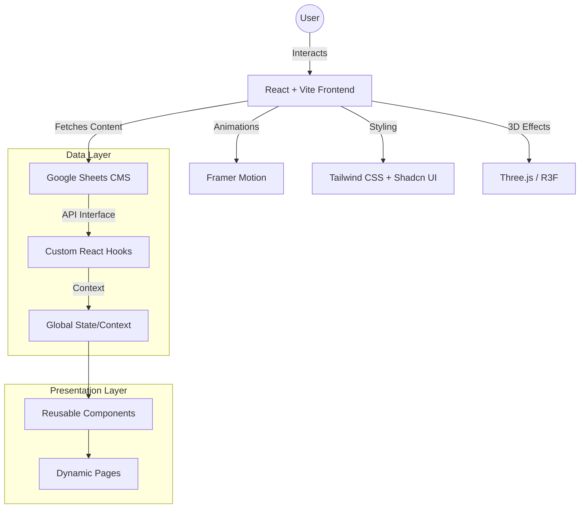

# Technical Architecture Overview

This project is built using a modern, scalable stack designed for performance, maintainability, and dynamic content management.

## System Architecture

## Key Technologies

| Technology | Purpose | Impact |
| --- | --- | --- |
| **Vite** | Build Tool | Extremely fast development and optimized production bundles. |
| **React** | Framework | Component-based architecture for better maintainability. |
| **Tailwind CSS** | Styling | Rapid UI development with a utility-first approach. |
| **Framer Motion** | Animations | Smooth, professional micro-interactions and scroll-reveals. |
| **Google Sheets CMS** | Backend | Allows non-technical users to update site content in real-time. |
| **Three.js** | 3D Graphics | Premium visual depth through floating 3D shapes. |

## Advanced Features Implemented

1.  **Dynamic i18n:** Multi-language support (RU, EN, KK) integrated directly with the CMS.
2.  **Scroll-Triggered Reveals:** Enhances user engagement by animating components as they enter the viewport.
3.  **JSON-LD SEO:** Standardized structured data for search engine optimization.
4.  **Interactive Analytics:** Data visualization using Recharts to display marketing impact.
5.  **Page Loader:** Professional entry transition that hides layout shift during data fetching.
